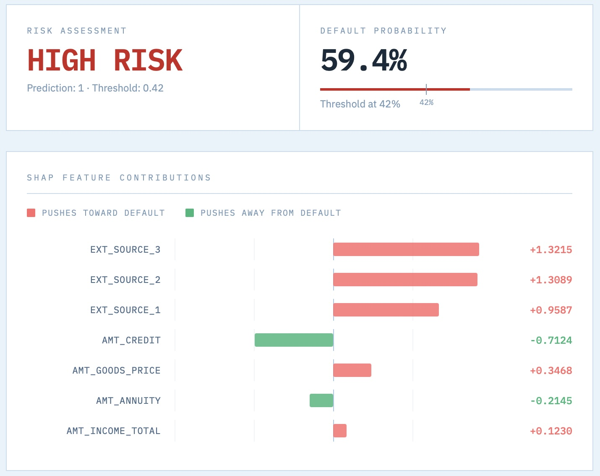
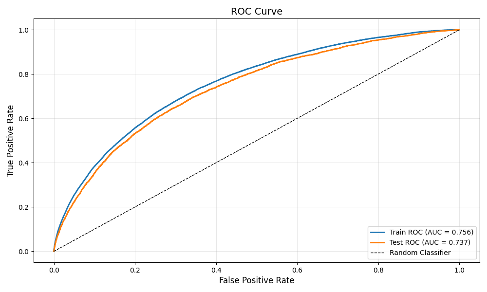
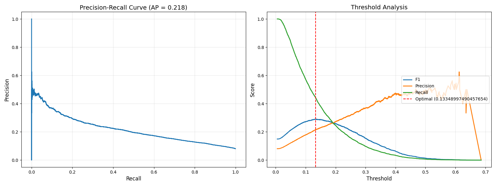
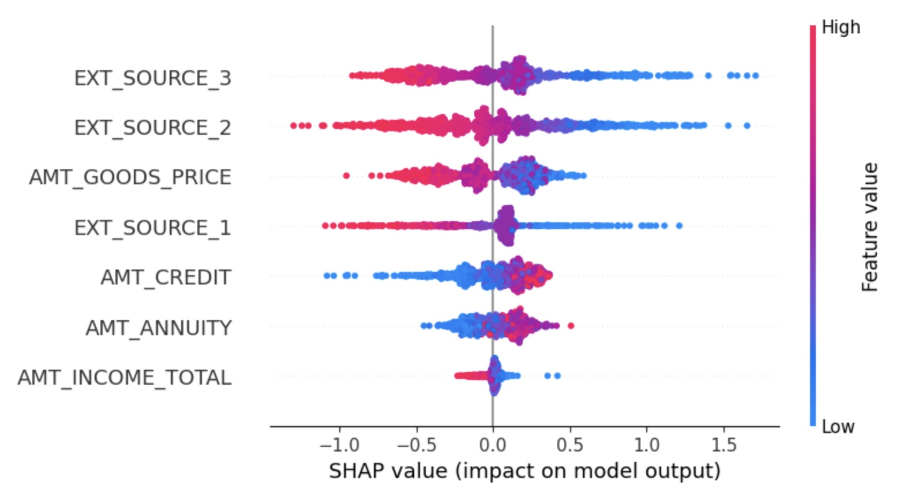
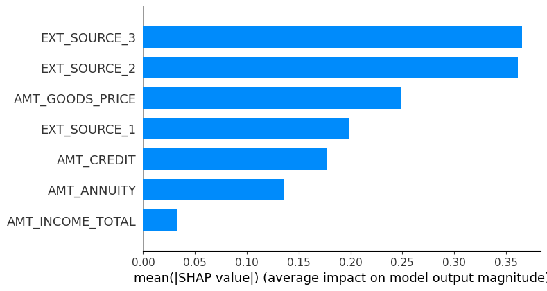

# Loan Default Prediction

A machine learning pipeline for predicting loan defaults using application features. This project implements end-to-end MLOps practices including experiment tracking, data versioning, reproducible model training, and a method for inference.

## Table of Contents

- [Overview](#overview)
- [Features](#features)
- [Project Structure](#project-structure)
- [Installation](#installation)
- [Usage](#usage)
- [Inference](#inference)
- [Configuration](#configuration)
- [Model Performance](#model-performance)
- [Development](#development)
- [Contributing](#contributing)
- [License](#license)

## Overview

This project builds a classification model to predict loan default risk by analyzing:
- Customer application data
- Credit card balance history
- Payment behavior patterns
- Demographic and financial indicators

The pipeline supports:
- ✅ Parameterized feature engineering
- ✅ Multiple model algorithms (Random Forest, XGBoost, LightGBM)
- ✅ Hyperparameter tuning with cross-validation
- ✅ MLflow experiment tracking
- ✅ Data versioning with DVC
- ✅ Reproducible training workflows

The model can be used to produce inferences on loan default:



## Features

### Feature Engineering
- Credit utilization metrics (current and historical max)
- Days past due (DPD) indicators across multiple time windows
- Minimum payment behavior analysis
- Months on book (MOB) and installment tracking
- Demographic bucketing and categorical encoding

### Model Pipeline
- Scikit-learn preprocessing pipeline with multiple transformers
- Support for experimenting with numeric, categorical, ordinal, and flag features
- Stratified train/test splitting
- Cross-validation for robust evaluation
- Comprehensive metrics: AUC, F1, Precision, Recall

### MLOps
- MLflow for experiment tracking and model registry
- DVC for data and model versioning
- YAML-based configuration management
- ROC curve visualization and artifact logging

## Project Structure

```
homecredit/
│
├── home-credit-default-risk/
│   ├── artifacts/
│   │   ├── preprocessor.pkl
│   │   ├── model_classifier.pkl
│   │   ├── predictions.csv
│   │   ├── roc_curve.png
│   │   └── pr_curve.png
│   ├── home-credit-default-risk/
│   │   ├── application_test.csv
│   │   ├── application_train.csv
│   │   ├── credit_card_balance.csv
│   │   └── ...
│   └── processed/
│       └── .gitkeep
│
├── scripts/
│   ├── train.py                 # Main training script
│   ├── inference.py             # Batch inference script
│   ├── app.py                   # Flask REST API server
│   └── index.html               # Browser scoring UI
│
├── utils/
│   ├── __init__.py
│   ├── preprocessing.py         # Feature engineering and data prep
│   └── model.py                 # Model creation and evaluation
│
├── mlruns/                      # MLflow experiment logs
│
├── notebooks/                   # Exploratory data analysis
│   └── credit_card.ipynb
│
├── tests/                       # Unit tests
│   ├── test_preprocessing.py
│   └── test_model.py
│
├── params.yaml                  # Model and training configuration
├── requirements.txt             # Python dependencies
├── .gitignore
├── .dvcignore
├── README.md
└── LICENSE
```

## Installation

### Prerequisites

- Python 3.8+
- pip or conda

### Setup

1. **Clone the repository**
   ```bash
   git clone https://github.com/caseywhorton/loan-default-prediction.git
   cd loan-default-prediction
   ```

2. **Create virtual environment**
   ```bash
   python -m venv venv
   source venv/bin/activate  # On Windows: venv\Scripts\activate
   ```

3. **Install dependencies**
   ```bash
   pip install -r requirements.txt # OR: pip3 install -r requirements.txt
   ```

4. **Pull data with DVC** (if using DVC)
   ```bash
   dvc pull
   ```

5. **Set up MLflow tracking** (optional)
   ```bash
   mlflow ui
   # Navigate to http://localhost:5000
   ```

## Usage

### Basic Training

Navigate to the scripts directory and run:

```bash
cd scripts
python train.py
```

This will:
1. Load data from `data/raw/application_train.csv` and `data/raw/credit_card_balance.csv`
2. Apply feature engineering based on `params.yaml` configuration
3. Train the model with specified hyperparameters
4. Log metrics and artifacts to MLflow
5. Save the trained preprocessing pipeline to `artifacts/preprocessor.pkl`
6. Save the trained model to `artifacts/model_classifier.pkl`

### Viewing Results

**MLflow UI:**
```bash
mlflow ui
```
Navigate to `http://localhost:5000` to compare experiments, view metrics, and analyze model performance.

**Saved Artifacts:**
- Trained model: `artifacts/model_classifier.pkl`
- ROC curve: `artifacts/roc_curve.png`

_**Note:** The saved artifacts in your local directory will be overwritten with each run, but the history of runs will be on MLflow._

### Making Predictions

```python
import pickle
import pandas as pd

# Load trained model
with open('artifacts/model_classifier.pkl', 'rb') as f:
    model = pickle.load(f)

# Load new data
new_data = pd.read_csv('path/to/new_data.csv')

# Make predictions
predictions = model.predict(new_data)
probabilities = model.predict_proba(new_data)[:, 1]
```

## Inference

The project supports two inference methods: batch predictions over a dataset, and a REST API for single-record scoring with a browser-based UI.

### Batch Inference

Run predictions over a full dataset and save results to a CSV file:

```bash
cd scripts
python inference.py
```

This will:
1. Load data from `data/inference/application_test.csv` and `data/inference/credit_card_balance.csv`
2. Preprocess and engineer features using the same pipeline as training
3. Load the trained model from `artifacts/model_classifier.pkl`
4. Apply the optimal classification threshold from `params.yaml`
5. Save predictions and probabilities to `artifacts/predictions.csv`

Output columns:
- All input features
- `prediction` — binary default prediction (0 or 1)
- `probability` — predicted default probability

### REST API

Start the Flask inference server:

```bash
cd scripts
python app.py
```

The server runs at `http://localhost:5001`.

#### Endpoints

| Method | Endpoint | Description |
|--------|----------|-------------|
| GET | `/health` | Health check, returns threshold and expected features |
| GET | `/features` | Returns expected feature names and types |
| POST | `/predict` | Run inference on a single record |

#### Example Request

```bash
curl -X POST http://localhost:5001/predict \
  -H "Content-Type: application/json" \
  -d '{
    "AMT_ANNUITY": 24700.5,
    "AMT_INCOME_TOTAL": 202500.0,
    "AMT_CREDIT": 406597.5,
    "AMT_GOODS_PRICE": 351000.0,
    "EXT_SOURCE_1": 0.502,
    "EXT_SOURCE_2": 0.655,
    "EXT_SOURCE_3": 0.489
  }'
```

#### Example Response

```json
{
  "prediction": 0,
  "probability": 0.0191,
  "threshold": 0.42,
  "feature_breakdown": {
    "AMT_ANNUITY":      { "value": 24700.5, "type": "numeric" },
    "EXT_SOURCE_2":     { "value": 0.655,   "type": "numeric" }
  },
  "shap_breakdown": {
    "AMT_ANNUITY":       -0.0312,
    "AMT_INCOME_TOTAL":  -0.0187,
    "AMT_CREDIT":         0.0041,
    "AMT_GOODS_PRICE":   -0.0098,
    "EXT_SOURCE_1":      -0.1203,
    "EXT_SOURCE_2":      -0.2341,
    "EXT_SOURCE_3":      -0.1876
  }
}
```

Positive SHAP values push toward default, negative values push away from default.

### Browser UI

With the Flask server running, open `http://localhost:5001` in your browser to access the scoring interface. Enter applicant feature values and submit to receive a risk verdict, default probability, and an interactive SHAP waterfall chart showing each feature's contribution to the prediction.

_**Note:** The Flask server is intended for local use and development. Do not expose it publicly without adding authentication and switching to a production WSGI server such as Gunicorn._

## Configuration

Model training is controlled via `params.yaml`.

### Adding New Features

1. Update `utils/preprocessing.py` with feature engineering logic
2. Add feature names to appropriate lists in `params.yaml`
3. Retrain the model: `python scripts/train.py`

## Model Performance

**ROC Curve Artifacts**  

For each training run, the ROC curve is saved to ML Flow.  




 **Precision Recall Curve Artifacts**

 For each training run, the Precision-Recall curve is saved to ML Flow.  

 Additionally, I show the maximum F1 score for different precision and recalls.




### Current Results

| Metric | Train | Test |
|--------|-------|------|
| AUC | 0.75 | 0.74 |
| F1 Score | 0.02 | 0.01 |
| Precision | 0.70 | 0.47 |
| Recall | 0.01 | 0.01 |

*These values are not great.*

### Feature Importance

The beeswarm plot below shows how each feature impacts the model's predictions. Each dot represents one observation. The x-axis shows the SHAP value — positive values push toward default, negative values push away. Color indicates the feature value: red = high, blue = low.

**Key takeaways:**
- `EXT_SOURCE_2` and `EXT_SOURCE_3` are the most influential features — low scores strongly push toward default
- `EXT_SOURCE_1` follows the same pattern but with less impact
- `AMT_INCOME_TOTAL` and `AMT_ANNUITY` contribute very little to individual predictions


  
The bar chart below shows mean absolute SHAP values for each feature.

**Key takeaways:**
- `EXT_SOURCE_3` and `EXT_SOURCE_2` are nearly equal in importance and dominate the other features
- `AMT_GOODS_PRICE` and `EXT_SOURCE_1` are mid-tier contributors
- `AMT_INCOME_TOTAL` has minimal impact — roughly 10x less influential than the top features

  



## Development

### Running Tests

```bash
pytest tests/
```

### Code Style

This project follows PEP 8 style guidelines. Format code with:

```bash
black .
flake8 .
```

### Adding New Models

1. Define model in `utils/model.py`
2. Update `create_model()` function to support new algorithm
3. Add hyperparameters to `params.yaml`
4. Run training and compare results in MLflow

### Experiment Tracking

All experiments are logged to MLflow with:
- Hyperparameters
- Training/test metrics (AUC, F1, Precision, Recall)
- Feature lists
- Model artifacts
- ROC curves

Compare experiments:
```bash
mlflow ui
# Navigate to http://localhost:5000
```

### Artifact Tracking with DVC

## Data & Artifact Versioning

This project uses DVC to version and store trained model artifacts. All artifacts are tracked under the `artifacts/` directory and pushed to a remote storage backend (Google Drive).

### Tracked Artifacts

| File | Description |
|------|-------------|
| `artifacts/model_classifier.pkl` | Trained LightGBM classification pipeline |
| `artifacts/preprocessor.pkl` | Trained data preprocessing pipeline |

### Checking Status

To see which artifacts have changed since the last push:
```bash
dvc status
```

### Pushing Artifacts

After training, push updated artifacts to the remote:
```bash
dvc push
```

### Pulling Artifacts

To restore artifacts on a new machine or after cloning the repo:
```bash
dvc pull
```

### Adding a New Artifact

If you add a new file to `artifacts/` that should be tracked:
```bash
dvc add artifacts/<filename>
git add artifacts/<filename>.dvc .gitignore
git commit -m "track <filename> with DVC"
dvc push
```

_**Note:** Always run `dvc push` from the project root, not from a subdirectory._

## Contributing

Contributions are welcome! Please follow these steps:

1. Fork the repository
2. Create a feature branch (`git checkout -b feature/your-feature`)
3. Commit your changes (`git commit -m 'Add new feature'`)
4. Push to the branch (`git push origin feature/your-feature`)
5. Open a Pull Request

## License

This project is licensed under the MIT License - see the [LICENSE](LICENSE) file for details.

## Acknowledgments

- Dataset: [Home Credit Default Risk](https://www.kaggle.com/c/home-credit-default-risk) (or specify your data source)
- MLflow documentation: https://mlflow.org/docs/latest/index.html
- Scikit-learn documentation: https://scikit-learn.org/

## Contact

**Casey Whorton**  
LinkedIn: [Casey Whorton](https://www.linkedin.com/in/caseywhorton/)  
GitHub: [@caseywhorton](https://github.com/caseywhorton)  

---

*Last updated: [April 21, 2026]*